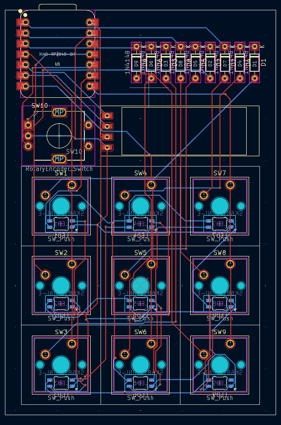

# MatrixPad
A 9 Key Programmable Macropad with Encoder & OLED Display  
MatrixPad is a fully programmable 9-key macropad designed for productivity, content creation, coding, and everyday shortcuts. Built around the **Seeed XIAO RP2040**, it features 9 Mechanical keys, a clean 3D-printed enclosure, rotary encoder input, and OLED display support.
## Features
* 9 Mechanical Keys (3x3 grid layout)
* Rotary Encoder 
* 0.91 inch OLED Display 
* Powered by Seeed XIAO RP2040 (Through-Hole)
* 2-Layer PCB (≤100mm x 100mm)
* Fully 3D Printed Case
* Programmable Firmware (KMK / QMK compatible)

---

## Overall Hackpad

## Schematic

## PCB

## Case Design

---

## BOM

| Item                          | Quantity |
|-------------------------------|----------|
| Seeed XIAO RP2040 (Through-Hole) | 1        |
| MX-Style Mechanical Switches  | 9        |
| Through-hole 1N4148 Diodes    | 9        |
| Blank DSA Keycaps (1u)        | 9        |
| SK6812 MINI-E LEDs             | 9        |
| EC11 Rotary Encoder            | 1        |
| 0.91” OLED (I2C)              | 1        |
| M3×16 mm Screws                | 4        |
| M3×5 mm Heatset Inserts        | 4        |
| PCB (2-Layer)                  | 1        |
| 3D Printed Case                | 1        |

